# Compose This

>  **Composition System for Godot 4.5+**

Compose is an add-on for Godot that adds a simple composition system. Each component is a script that can add functionality to any node.
The relationship between component and parent is flexible, meaning components can be disabled or removed from the parent at any time.

## 🔗 References
- [Installation](https://github.com/Ralob7002/Compose-This/edit/main/README.md#-installation)
- [Core Concepts](https://github.com/Ralob7002/Compose-This/edit/main/README.md#%EF%B8%8F-core-concepts)
- [Parent Query](https://github.com/Ralob7002/Compose-This/edit/main/README.md#-parent-query)
- [Creating Component](https://github.com/Ralob7002/Compose-This/edit/main/README.md#%EF%B8%8F-creating-a-component)

## 🔽 Installation

> [!TIP]
> Some errors may appear in Output, but they no longer appear after activating the addon.

1. Download the repository and move the `addons/compose-this` folder to your Godot Project, or download the addon directly from the Asset Library.
3. Go to `Project Settings -> Plugins` and check the **Compose This** checkbox.

## ⚙️ Core Concepts

- **Component:** GDScript that adds functionality to a node.
- **Parent:** Any node that has a component as a child.
- **Compose:** Autoloader that provides functions for working with components and parents.

Each parent can only have one type of the same component as a child. Components cannot have their names changed, as they always revert to the default name;
furthermore, if a component is added to a parent that already has its type, it will be automatically released.

Components cannot use the default `_ready()` function, as it will be called in the Editor. As an alternative, you should always use the `component_ready()` function, 
which works the same way but is not called in the Editor. If for some reason it is absolutely necessary to use the `_ready()` function, you should do it as follows:

```gdscript
func _ready() -> void:
	if not Engine.is_editor_hint():
		# Ready code...
```

A component cannot be a scene file, only a GDScript file that extends the Component class. Because the Component class extends the standard Node class,
it cannot perform drawing operations, so to perform drawing operations you need to use the component's parent. To do this, first connect
the parent's draw signal to the component and then perform the drawing operations on the callable connected to the signal.

```gdscript
# In the component's GDScript.

func _component_ready() -> void:
    # Connect the draw signal from the parent if it is a Node2D.
    if parent is Node2D:
	    parent.draw.connect(_on_parent_draw)

# The component design operations will be performed here.
func _on_parent_draw() -> void:
    parent.draw_circle(...)
    parent.draw_rect(...)
    ...
```

> [!TIP]
> Whenever the component needs to be redrawn, you should call the parent's `queue_redraw()` function.

To add components to the node, you need to use the `add_component()` function from `Compose`. If the component to be added already exists in the parent, 
then it will be replaced by the new component. If you want to avoid this, check if the parent already has the component with the `has_node()` function 
or use the `ensure_component()` function from `Compose`, as it adds the component only if the node does not have it. To remove components, you can use 
the standard function `remove_child()` from the `Node` class.

## 🔎 Parent Query

With this addon, it's possible to query nodes that contain specific components using the `query_all()` and `query_any()` functions from the `Compose` autoloader.

The `query_all()` function returns the nodes that contain all the components passed as a filter.

```gdscript
func destroy_fire_projectiles() -> void:
	var filter: Array = [ProjectileComponent, FireProjectileComponent]
	var query: Array = Compose.query_all(filter)
	
	for parent in query:
		parent.queue_free()
```

The `query_any()` function returns the nodes that contain at least one of the components passed in the filter.

```gdscript
func clear_effects() -> void:
	var filter: Array = [ParticleComponent, SqueezeComponent]
	var query: Array = Compose.query_any(filter)
	
	for parent in query:
		parent.queue_free()
```

## 🛠️ Creating a Component

Since a Component is just a `GDScript`, it can be strange to work with them, after all there is no visual feedback from a `SceneTree` and any node it needs 
must be referenced from a variable in `@export` or created in code. But since you only need to worry about the component's GDScript file, as development progresses, 
your project will become more organized and clean.

Now, to illustrate the creation of components, let's create a scene in Godot where we have a Player and an Enemy. The Player will follow the mouse position, 
and the Enemy will follow the Player's position. Let's start with the Enemy's behavior.

### Creating a Script

**1)** First, let's create the script for the component that will make the Enemy follow the Player.

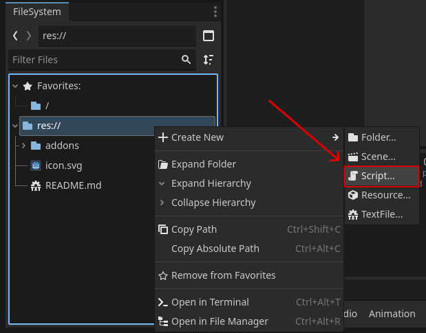

**2)** We rename the file to the component name and select inheritance from GDScript.

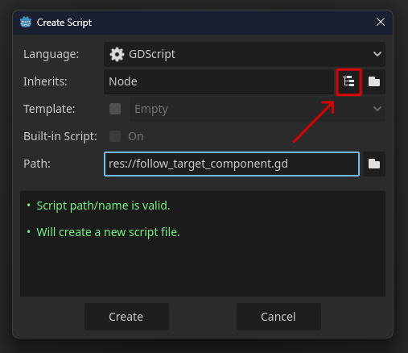

**3)** We select the Component object and then click on inherit. Done! We have a GDScript to start programming the component.

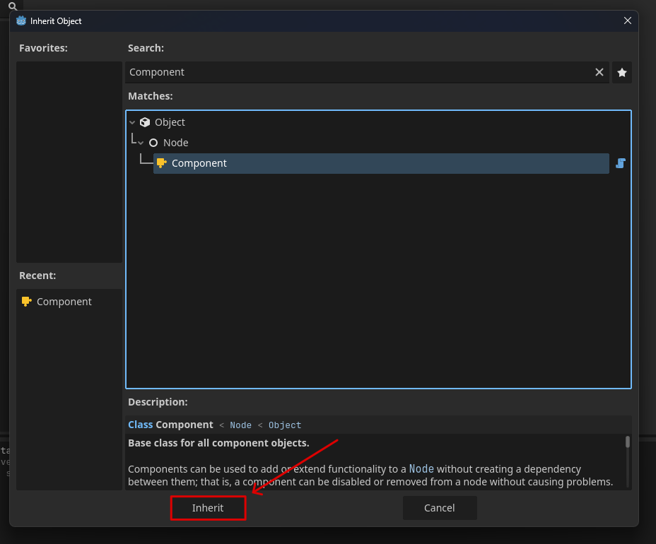

### Coding

**1)** Now let's program the `FollowTargetComponent`. First, we need to ensure that the script is a tool using the `@tool` tag and that it has a unique `class_name`. 
In this case: `FollowTargetComponent`. These two requirements must be met in all components.

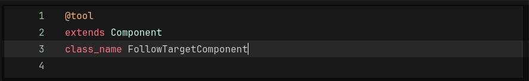

**2)** We will export the `target` variable, so the component knows what to follow, and `follow_speed`, to define the speed at which it will follow the target.

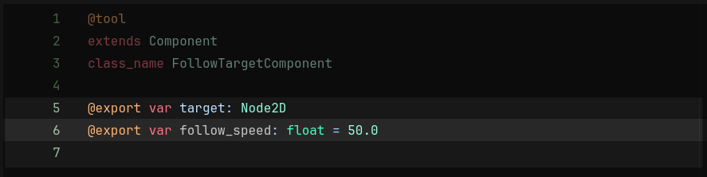

**3)** Then we can code the component logic. A recommendation is to always check the type of the `parent` before working with it using the reserved name `is`. 
Always perform checks to avoid errors in the components.


### Creating the Scene

**1)** Now let's put things in place by creating a main scene with a `Sprite2D` for the `Player` and another for the `Enemy`; I also added a `Camera2D` to center the scene.

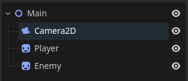

**2)** If we run the scene, nothing happens because we haven't added the components.

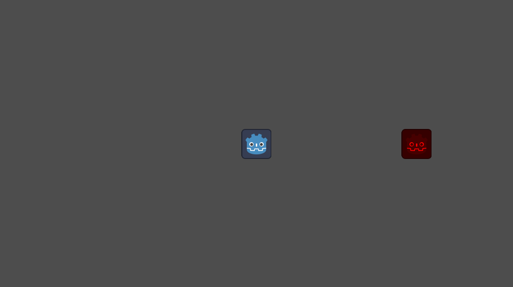

**3)** So let's add the `FollowTargetComponent` to the `Enemy` and configure it to follow the `Player` at a speed of 200.0 pixels per second.

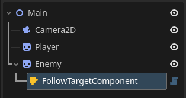
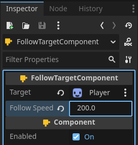

**4)** Now we have the following result.


### Finishing Up

**1)** To finish up, I created a `FollowMouseComponent` for the `Player` with the following code.

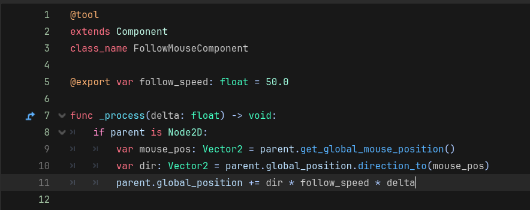

**2)** I added it to `Player` and configured it through the inspector.

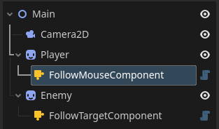
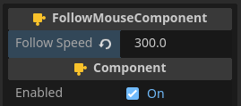

**3)** And we have the final result.


Done! We've learned how to create a component from scratch. Obviously, this example was quite simple compared to a real project, but it already shows the workflow of working with this add-on.
